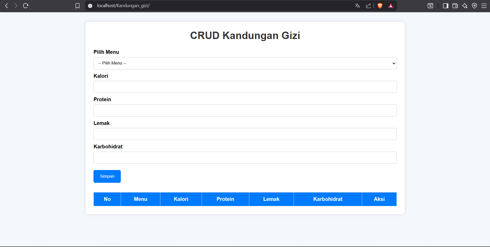

# Aplikasi CRUD Kandungan Gizi

## Screenshot Tampilan Aplikasi

---

## Deskripsi Aplikasi
Aplikasi ini adalah sistem informasi berbasis web sederhana bernama **CRUD Kandungan Gizi**. Aplikasi ini dirancang untuk mencatat, mengelola, dan memantau informasi nilai gizi dari berbagai menu makanan secara digital, sehingga memudahkan pengguna dalam mengontrol konsumsi nutrisi harian.

## Fitur Aplikasi
Berikut adalah beberapa fitur utama yang tersedia di dalam aplikasi ini:
* **Pilih Menu**: Memilih menu makanan yang akan dinilai kandungan gizinya.
* **Manajemen Kalori**: Melakukan input dan pencatatan jumlah kalori pada makanan.
* **Manajemen Protein**: Melakukan input dan pencatatan jumlah kandungan protein.
* **Manajemen Lemak**: Melakukan input dan pencatatan jumlah kandungan lemak.
* **Manajemen Karbohidrat**: Melakukan input dan pencatatan jumlah kandungan karbohidrat.
* **Aksi CRUD Dinamis**: Fitur lengkap untuk menyimpan data baru (Simpan), melihat data, mengubah data (Edit), serta menghapus data (Delete) nilai gizi makanan pada tabel yang disediakan.

## Cara Menjalankan Aplikasi

### Prasyarat (Prerequisites)
Sebelum menjalankan aplikasi, pastikan komputer kamu sudah terinstall:
* XAMPP (Mendukung PHP & MySQL)
* Web Browser (Google Chrome / Brave Browser / Mozilla Firefox)
* Git

### Langkah Instalasi
1. Pastikan folder project bernama `Kandungan_gizi` sudah berada di dalam direktori `C:/xampp/htdocs/`.
2. Buka aplikasi **XAMPP Control Panel** lalu aktifkan modul **Apache** dan **MySQL**.
3. Buka browser, lalu akses halaman database di `http://localhost/phpmyadmin/`.
4. Buat database baru (misalnya dengan nama `db_gizi` atau sesuaikan dengan file database `.sql` milikmu).
5. Import file database berformat `.sql` yang ada di folder project kamu ke dalam database baru tersebut.
6. Buka tab baru di browser, lalu akses aplikasi dengan mengetik URL: `http://localhost/Kandungan_gizi/`.

## Struktur Database
Aplikasi ini menggunakan database MySQL dengan struktur tabel utama sebagai berikut:

* **Tabel `kandungan_gizi`** (atau nama tabel gizi di database kamu):
  * `id / no`: Sebagai primary key (auto increment) penomoran data.
  * `menu`: Menyimpan nama atau pilihan menu makanan.
  * `kalori`: Menyimpan nilai/jumlah kalori makanan.
  * `protein`: Menyimpan nilai/jumlah kandungan protein.
  * `lemak`: Menyimpan nilai/jumlah kandungan lemak.
  * `karbohidrat`: Menyimpan nilai/jumlah kandungan karbohidrat.
